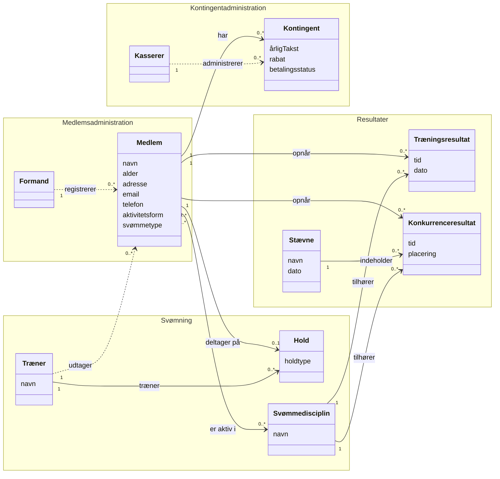

# Domænemodel – Svømmeklubben Delfinen

```mermaid
classDiagram
direction LR

namespace Medlemsadministration {
    class Medlem {
        navn
        alder
        adresse
        email
        telefon
        aktivitetsform
        svømmetype
    }

    class Formand
}

namespace Kontingentadministration {
    class Kontingent {
        årligTakst
        rabat
        betalingsstatus
    }

    class Kasserer
}

namespace Svømning {
    class Træner {
        navn
    }

    class Hold {
        holdtype
    }

    class Svømmedisciplin {
        navn
    }
}

namespace Resultater {
    class Træningsresultat {
        tid
        dato
    }

    class Konkurrenceresultat {
        tid
        placering
    }

    class Stævne {
        navn
        dato
    }
}

%% Relationer og multipliciteter

Formand "1" ..> "0..*" Medlem : registrerer

Medlem "1" --> "0..*" Kontingent : har
Kasserer "1" ..> "0..*" Kontingent : administrerer

Medlem "0..*" --> "0..1" Hold : deltager på
Træner "1" --> "0..*" Hold : træner

Medlem "0..*" --> "0..*" Svømmedisciplin : er aktiv i

Medlem "1" --> "0..*" Træningsresultat : opnår
Svømmedisciplin "1" --> "0..*" Træningsresultat : tilhører

Medlem "1" --> "0..*" Konkurrenceresultat : opnår
Stævne "1" --> "0..*" Konkurrenceresultat : indeholder
Svømmedisciplin "1" --> "0..*" Konkurrenceresultat : tilhører

Træner "1" ..> "0..*" Medlem : udtager
```
